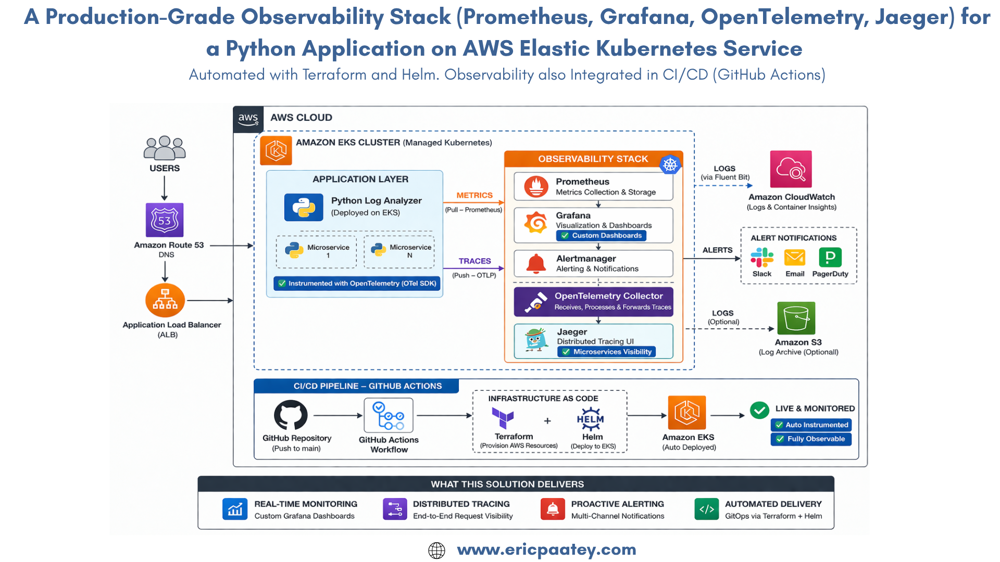

# Production-Grade Observability Stack (Prometheus, Grafana, OpenTelemetry, Jaeger) for a Python Application on AWS EKS 

(A fully automated cloud-native deployment of a Python Log Analyzer app running on Kubernetes using AWS Elastic Kubernetes Service (EKS). Automated with Terraform, Docker, and CI/CD pipeline using GitHub Actions.)

This project demonstrates a production-grade observability stack (Prometheus, Grafana, OpenTelemetry and Jaeger) for a Python application deployed on AWS Elastic Kubernetes Service (EKS). The project further demonstrates how modern DevOps workflow with Infrastructure as Code, CI/CD automation, containerization, and Kubernetes orchestration combined with observability.

The Observability stack (in summary):
1. Implements distributed tracing with OpenTelemetry and Jaeger for enhanced microservices visibility
2. Automates infrastructure provisioning using Terraform and Helm 
3. Pairs Prometheus with custom Grafana dashboards for real-time system monitoring
4. Integrates observability into CI/CD pipelines (GitHub Actions).

---

## Architecture Overview

The application is deployed using a fully automated pipeline:

Developer Push → GitHub → CI/CD → Docker → Amazon ECR → Terraform → AWS EKS → Kubernetes Pods → ALB → Users

### Key Components

- **Terraform** – Infrastructure provisioning
- **GitHub Actions** – CI/CD pipeline
- **Docker** – Containerized Python application
- **Amazon ECR** – Container registry
- **Amazon EKS** – Kubernetes cluster
- **Amazon RDS (PostgreSQL)** – Database for storing log results
- **Application Load Balancer (ALB)** – External traffic routing
- **Prometheus, Grafana, OpenTelemetry and Jaeger** – Logging, monitoring, and Tracing
- **S3 Remote State + DynamoDB Locking** – Terraform state management

---

## Architecture Diagram

---

## Application Overview (Summary)

The **Python Log Analyzer API** processes log files and extracts useful insights such as:

- Error frequency
- Top IP addresses
- Status code distribution
- Suspicious activity patterns

---

## Infrastructure Provisioning (Terraform + Helm)

Terraform provisions the following AWS resources:

- VPC and networking
- Amazon EKS cluster
- IAM roles and policies
- Amazon RDS PostgreSQL database
- Application Load Balancer
- Security groups
- CloudWatch (for monitoring & Observability)

### Terraform Backend

Remote state management:

- **Amazon S3** – Terraform state storage
- **DynamoDB** – State locking

---

## CI/CD Pipeline

The CI/CD pipeline is implemented using **GitHub Actions**.

Pipeline steps:

1. Code pushed to GitHub
2. Build Docker image
3. Push image to Amazon ECR
4. Run Terraform apply
5. Deploy application to Kubernetes
  
---

## Kubernetes Deployment

The application is deployed using Kubernetes manifests.

### Deployment

kubectl apply -f k8s/deployment.yaml

### Service
kubectl apply -f k8s/service.yaml

### Ingress
kubectl apply -f k8s/ingress.yaml

---

## Traffic Flow

User → Application Load Balancer → Kubernetes Ingress → Service → Pods → PostgreSQL Database

---

## Monitoring and Observability
The project implements distributed tracing with OpenTelemetry and Jaeger for microservices visibility.  Custom Grafana dashboards have been designed and incorporated for real-time system monitoring. Observability has also been integrated into CI/CD pipelines (GitHub Actions)

- **Amazon CloudWatch Logs**
- Container logs from EKS
- ALB access logs

This allows tracking:

- API request logs
- Kubernetes pod logs
- infrastructure metrics

---
KEY TECH STACK USED:
-Python (app development)
-Docker (packaging the Python application as a Docker image)
-Terraform + Helm (provisioning relevant infrastructure on AWS)
-S3 Remote State + DynamoDB Locking (Terraform state management)
-Amazon ECR (Container registry for storing the Docker image)
-Amazon EKS (Kubernetes cluster for orchestrating the microservice python app)
-Amazon RDS (PostgreSQL): the Database for storing log results generated by the application.
-Application Load Balancer (ALB) for External traffic routing
-GitHub Actions (CI/CD pipeline)
-Prometheus, Grafana, OpenTelemetry and Jaeger for logging, monitoring, and tracing

## What the Observability Stack Delivers
1. Realtime Monitoring using Prometheus paired with custom Grafana Dashboards
2. Distributed Tracing via OpenTelemetry: provides end-to-end request visibility
3. Proactive Alerting: provides multi-channel notifications via email and Slack.
4. Automated Delivery: the entire stack is deployed automatically via Terraform and Helm without clicking around the console.

## Key DevOps Concepts Demonstrated

- Infrastructure as Code
- Kubernetes container orchestration
- CI/CD automation
- Immutable infrastructure
- Cloud-native application deployment
- Observability and monitoring

---

## Author - Eric Paatey

I built this project as part of my **DevOps Build Lab**, a series of my hands-on cloud engineering projects focused on real-world infrastructure automation.

